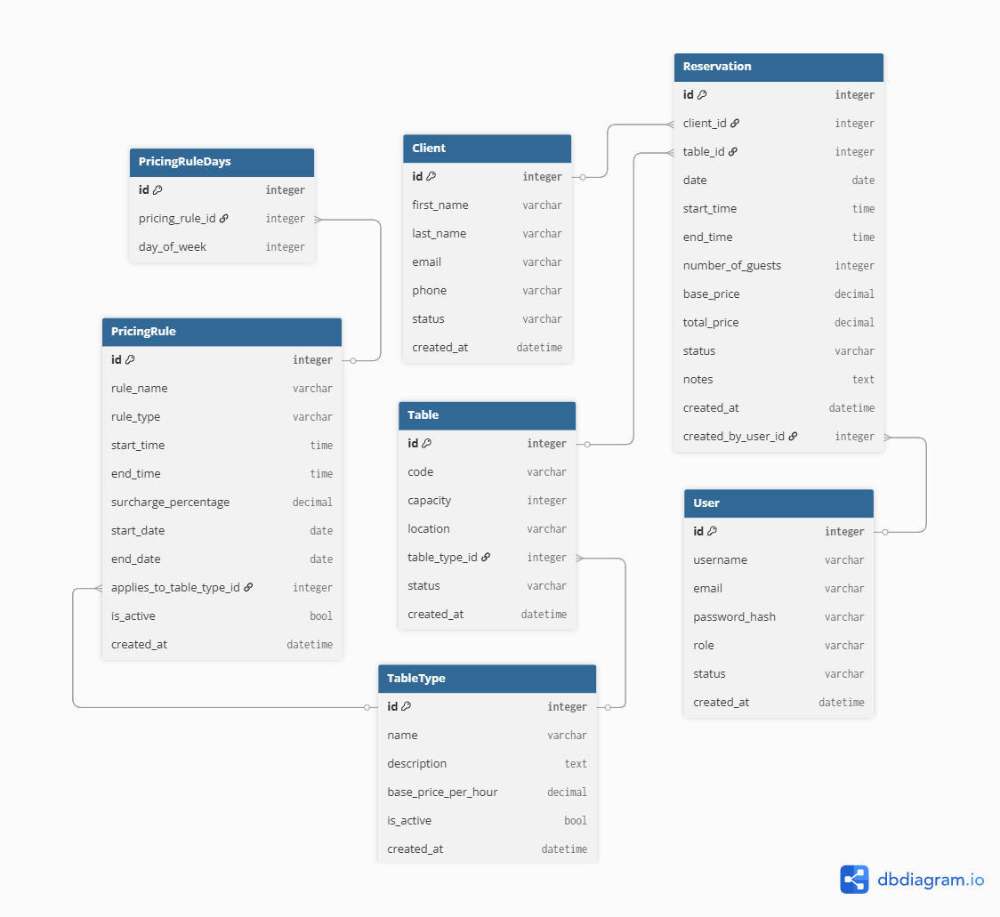

# 🍽️ Restaurant Reservation System

A full-stack restaurant reservation management system built with **ASP.NET Core** backend and **React** frontend. This system is designed for restaurant administrators and staff to manage table reservations, clients, and availability in real-time.

[](#tech-stack)
[](#database-schema)
[](#development-status)

## 📋 Table of Contents

- [Overview](#overview)
- [Features](#features)
- [Tech Stack](#tech-stack)
- [Database Schema](#database-schema)
- [Business Rules](#business-rules)
- [Project Structure](#project-structure)
- [Getting Started](#getting-started)
- [API Endpoints](#api-endpoints)
- [Development Status](#development-status)
- [Contributing](#contributing)

## 🎯 Overview

The Restaurant Reservation System enables authorized restaurant staff to efficiently manage:
- **Client Management**: Store and manage customer information and reservation history
- **Table Management**: Configure tables, capacities, and pricing by table type (Normal, Terrace, VIP)
- **Reservation Management**: Create, edit, and track reservations with dynamic pricing
- **User Management**: Role-based access control for administrators and employees

> **Note**: Only authorized personnel can perform operations. Clients cannot make reservations directly through this system.

## ✨ Features

### 🧑‍💼 Client Management
- ➕ Add, edit, delete, and view client profiles
- 📧 Store contact information (email, phone)
- 📊 Track complete reservation history
- 🔍 Search and filter clients

### 🪑 Table Management
- 🏗️ Manage physical tables and seating capacity
- 🏷️ Assign table types with different pricing:
  - **Normal Tables**: Standard pricing
  - **Terrace Tables**: Outdoor seating with premium
  - **VIP Tables**: Premium experience with highest rates
- 📈 Track table status (Active, Maintenance, Inactive)
- 📍 Optional location tracking within restaurant

### 📅 Reservation Management
- 🆕 Create, edit, and cancel reservations
- ⏰ Real-time table availability checking
- 💰 Dynamic pricing calculation:
  - Base price per hour by table type
  - Weekend/holiday surcharges
  - Peak hour surcharges
- 📋 Support for special notes and requirements
- 🔄 Reservation status tracking (Confirmed, Canceled, No Show)

### 👥 User Management
- 🔐 Role-based authentication (Admin, Employee)
- 👤 User account management
- 🛡️ JWT-based secure authentication
- 📊 User activity tracking

## 🛠️ Tech Stack

### Backend
- **Framework**: ASP.NET Core Web API
- **ORM**: Entity Framework Core
- **Database**: SQL Server (configurable)
- **Authentication**: JWT Bearer tokens
- **Documentation**: Swagger/OpenAPI

### Frontend
- **Framework**: React (JavaScript/TypeScript)
- **Styling**: Tailwind CSS
- **State Management**: Context API / Redux (TBD)
- **HTTP Client**: Axios
- **UI Components**: Custom components with Tailwind

### Development Tools
- **IDE**: Visual Studio / VS Code
- **Version Control**: Git
- **Package Managers**: NuGet (backend), npm/yarn (frontend)

## 🗄️ Database Schema

The system uses 5 core entities with the following relationships:

### 📊 Entity Relationship Diagram


### 🏷️ Core Entities

#### TableType
| Field | Type | Description |
|-------|------|-------------|
| Id | PK | Unique identifier |
| Name | string | Table type (Normal, Terrace, VIP) |
| Description | string | Optional description |
| BasePricePerHour | decimal | Base hourly rate |
| DaySurcharge | decimal | Weekend/holiday surcharge |
| PeakHourSurcharge | decimal | Peak hour surcharge |
| IsActive | bool | Availability status |
| CreatedAt | datetime | Creation timestamp |

#### Table
| Field | Type | Description |
|-------|------|-------------|
| Id | PK | Unique identifier |
| TableCode | string | Human-friendly identifier |
| Capacity | int | Maximum guest capacity |
| TableTypeId | FK | Reference to TableType |
| Location | string | Physical location (optional) |
| Status | enum | Active, Maintenance, Inactive |
| CreatedAt | datetime | Creation timestamp |

#### Client
| Field | Type | Description |
|-------|------|-------------|
| Id | PK | Unique identifier |
| FirstName | string | Client's first name |
| LastName | string | Client's last name |
| Email | string | Unique email address |
| Phone | string | Contact phone number |
| Status | enum | Active, Inactive |
| CreatedAt | datetime | Creation timestamp |

#### Reservation
| Field | Type | Description |
|-------|------|-------------|
| Id | PK | Unique identifier |
| ClientId | FK | Reference to Client |
| TableId | FK | Reference to Table |
| Date | date | Reservation date |
| StartTime | time | Start time |
| EndTime | time | End time |
| NumberOfGuests | int | Party size |
| BasePrice | decimal | Calculated base price |
| DaySurcharge | decimal | Applied day surcharge |
| PeakHourSurcharge | decimal | Applied peak hour surcharge |
| TotalPrice | decimal | Final calculated price |
| Status | enum | Confirmed, Canceled, NoShow |
| Notes | string | Special requests/notes |
| CreatedAt | datetime | Creation timestamp |
| UpdatedAt | datetime | Last modification |

#### User
| Field | Type | Description |
|-------|------|-------------|
| Id | PK | Unique identifier |
| Username | string | Unique username |
| PasswordHash | string | Secure password hash |
| Role | enum | Admin, Employee |
| Status | enum | Active, Inactive |
| CreatedAt | datetime | Creation timestamp |

## 📏 Business Rules

1. **Table Availability**: Only available tables can be booked for specific time ranges
2. **Dynamic Pricing**: Prices calculated using:
   - Base price per hour from TableType
   - Duration in hours
   - Weekend/holiday surcharges
   - Peak hour surcharges
3. **Unique Constraints**:
   - Client email addresses must be unique
   - Usernames must be unique
   - Table codes should be unique
4. **Reservation Conflicts**: No overlapping reservations for the same table and time
5. **Data Integrity**: Deleting clients preserves reservation history for auditing

## 📁 Project Structure

```
restaurant-reservation-react-aspnet/
├── 📁 docs/
│   └── erd_diagram.png          # Entity Relationship Diagram
├── 📄 ReservationController.cs  # API Controller (in development)
├── 📄 requirements.md          # Detailed project requirements
├── 📄 .gitignore              # Git ignore patterns
└── 📄 README.md               # This file
```

## 🚀 Getting Started

### Prerequisites
- .NET 6.0 or later
- Node.js 16+ and npm/yarn
- SQL Server (LocalDB for development)
- Visual Studio 2022 or VS Code

### Installation

1. **Clone the repository**
   ```bash
   git clone <repository-url>
   cd restaurant-reservation-react-aspnet
   ```

2. **Backend Setup**
   ```bash
   # Navigate to backend directory (when created)
   cd backend
   
   # Restore NuGet packages
   dotnet restore
   
   # Update database connection string in appsettings.json
   # Run database migrations
   dotnet ef database update
   
   # Start the API
   dotnet run
   ```

3. **Frontend Setup**
   ```bash
   # Navigate to frontend directory (when created)
   cd frontend
   
   # Install dependencies
   npm install
   
   # Start development server
   npm start
   ```

### Environment Variables

Create `.env` files for configuration:

**Backend (appsettings.json)**
```json
{
  "ConnectionStrings": {
    "DefaultConnection": "Server=(localdb)\\mssqllocaldb;Database=RestaurantReservationDB;Trusted_Connection=true;"
  },
  "JwtSettings": {
    "SecretKey": "your-secret-key",
    "Issuer": "RestaurantReservationAPI",
    "Audience": "RestaurantReservationClient"
  }
}
```

**Frontend (.env)**
```env
REACT_APP_API_BASE_URL=https://localhost:7000/api
```

## 🔌 API Endpoints

### Authentication
- `POST /api/auth/login` - User login
- `POST /api/auth/register` - Register new user (Admin only)

### Reservations
- `GET /api/reservations` - List all reservations
- `GET /api/reservations/{id}` - Get specific reservation
- `POST /api/reservations` - Create new reservation
- `PUT /api/reservations/{id}` - Update reservation
- `DELETE /api/reservations/{id}` - Cancel reservation

### Tables
- `GET /api/tables` - List all tables
- `GET /api/tables/available` - Check table availability
- `POST /api/tables` - Create new table (Admin only)
- `PUT /api/tables/{id}` - Update table (Admin only)

### Clients
- `GET /api/clients` - List all clients
- `GET /api/clients/{id}` - Get client details
- `POST /api/clients` - Add new client
- `PUT /api/clients/{id}` - Update client information

### Table Types
- `GET /api/tabletypes` - List table types and pricing
- `POST /api/tabletypes` - Create table type (Admin only)
- `PUT /api/tabletypes/{id}` - Update pricing (Admin only)

## 📈 Development Status

### ✅ Completed
- [x] Project requirements and specifications
- [x] Database schema design and ERD
- [x] .gitignore configuration
- [x] Project documentation

### 🚧 In Progress
- [ ] Backend API implementation
- [ ] Database models and Entity Framework setup
- [ ] Authentication system
- [ ] Core CRUD operations

### 📋 Planned
- [ ] Frontend React application
- [ ] API integration
- [ ] User interface design
- [ ] Testing suite
- [ ] Deployment configuration

### 🎯 Next Steps
1. Implement Entity Framework models
2. Create database migrations
3. Build core API controllers
4. Set up JWT authentication
5. Create React frontend structure
6. Integrate frontend with backend API

## 🤝 Contributing

This is a personal project, but suggestions and feedback are welcome!

### Development Guidelines
- Follow established code patterns and conventions
- Write meaningful commit messages
- Update documentation for new features
- Test thoroughly before committing

### Code Style
- **Backend**: Follow C# coding conventions
- **Frontend**: Use ESLint and Prettier configurations
- **Database**: Use descriptive naming for entities and fields

---

## 📞 Contact

**Developer**: Keyner  
**Project**: Restaurant Reservation System  
**Technology**: ASP.NET Core + React  

---

*This README will be updated as the project progresses. Last updated: 2025-09-21*
